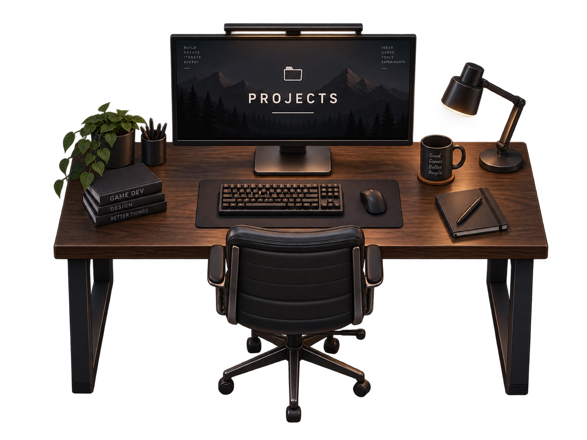

# Project 1 AI Prompt Log

**Student:** Takashi Shaw  
**Course:** CMU 15-113  
**Project:** Project 1 — Personal Portfolio Website  
**AI Tool Used:** ChatGPT (OpenAI, GPT-5.6 Sol)  
**Primary Development Environment:** VS Code, HTML, CSS, JavaScript, GitHub Pages

> This log is a condensed record of the prompts and AI-assisted work used while building the project. Repeated debugging exchanges and small wording changes are grouped together for readability.

---

## 1. Initial project setup and planning

### Prompt
I am working on CMU 15-113 Project 1 and want to build a personal portfolio website. Assume I have completed the setup tasks in the assignment document. Help me build it in phases and tell me when I need to create new files.

### AI assistance
- Broke the project into phases:
  1. HTML structure
  2. CSS styling
  3. JavaScript interactions
- Recommended keeping the main landing page as `index.html`.
- Helped create the initial `index.html`, later adding `style.css` and `script.js`.
- Explained how to run the website locally using VS Code / Live Server.

---

## 2. Portfolio concept and design direction

### Prompt
I want the portfolio to be creative and interactive. I like the Bruno Simon game portfolio style, but I do not want the site to feel confusing or like a normal website with a game added to it.

### AI assistance
- Helped develop the concept of a **game-first portfolio**.
- Recommended a single-screen dark room environment with:
  - player movement
  - interactive objects
  - a visible portfolio HUD/sidebar
  - section information that remains easy to access
- Recommended a 2D / 2.5D approach instead of full 3D because it was more achievable for the assignment timeline.

---

## 3. Section layout and room-object mapping

### Prompt
I want Projects to be the most important part of the room and Resume to be second. I also need About Me, Experience, Skills, Interests, and Contact.

### AI assistance
Mapped portfolio sections to room objects:

- Projects → computer desk / monitor
- Resume → document station / side desk
- About Me → bookshelf
- Experience → bulletin board
- Skills → shelf / workstation
- Interests → football, viola, and headphones
- Contact → phone

The sidebar order was set to:

1. Projects
2. Resume
3. About Me
4. Experience
5. Skills
6. Interests
7. Contact

---

## 4. HTML and CSS room prototype

### Prompt
Make the game area the main thing. I do not want large headings outside the game. I want the navigation to feel like a HUD over the room.

### AI assistance
- Restructured the page so `#game-area` fills the viewport.
- Added:
  - room background layers
  - HUD/header
  - right-side portfolio menu
  - hidden source sections for portfolio content
  - popup portfolio panel
- Built the first room objects using CSS shapes and simple furniture prototypes.

---

## 5. JavaScript portfolio panel system

### Prompt
I want clicking a room object or the sidebar to open the same content instead of scrolling down the page.

### AI assistance
Implemented JavaScript that:
- prevents sidebar anchor scrolling
- opens a floating portfolio panel
- copies content from hidden HTML sections into the panel
- highlights the active room object and menu item
- closes the panel with the close button or Escape

---

## 6. Player movement and interaction

### Prompt
I want the player to move with WASD / arrow keys and press E to interact with objects.

### AI assistance
Implemented:
- WASD and arrow-key movement
- player position stored as room percentages
- trapezoid-shaped floor boundaries
- collision detection
- proximity detection
- `[E]` interaction prompt
- pressing E to open the nearest portfolio section

---

## 7. Collision debugging

### Prompt
The player and several objects are piling up around the Resume station and the interaction prompt says the wrong section.

### AI assistance
- Identified incorrect HTML nesting caused by a missing closing `</div>`.
- Rebuilt the Resume room-object block with correct sibling structure.
- Preserved the hidden `<section id="resume">` content section.
- Restored correct positions for Resume, Interests, Contact, and the player.

---

## 8. Wall-object proximity problem

### Prompt
I cannot interact with Experience because I cannot get close enough without Projects overriding it.

### AI assistance
Created separate interaction points using:

```html
data-interact-x="..."
data-interact-y="..."
```

for wall-mounted objects such as:
- About Me
- Experience
- Skills

This separated the object's visible location from the player's reachable interaction location.

---

## 9. Floor-object proximity problem

### Prompt
Projects and Resume only work from the bottom and not from the sides.

### AI assistance
Changed proximity calculations for floor furniture to measure the player's distance from the **nearest edge of the visual rectangle** instead of the center.

This allowed Projects and Resume to be accessed from multiple sides while wall objects continued using custom interaction points.

---

## 10. Recovery after accidental undo

### Prompt
I accidentally undid a lot of things and I am struggling. Please help restore the project.

### AI assistance
Reviewed the current HTML and JavaScript, then restored:
- About and Skills interaction coordinates
- correct player structure
- proximity logic
- collision logic
- missing / extra braces in JavaScript
- duplicate placeholder elements

---

## 11. Temporary player character

### Prompt
What are the next steps?

### AI assistance
Replaced the simple `YOU` circle with a small temporary humanoid made with HTML/CSS and added:
- walking animation
- player facing direction
- subtle body bounce
- perspective scaling based on vertical position

The player remained intentionally simple because the room and portfolio content were higher priority.

---

## 12. 2.5D depth sorting

### Prompt
I want the player to feel like they belong in a 2.5D room.

### AI assistance
Added basic depth sorting so the player and furniture receive z-index values based on their vertical position in the room.

This allowed the player to visually pass in front of or behind furniture.

---

## 13. Generated Projects desk artwork

### Prompt
Let's start with the actual art now.

### AI assistance
Generated a transparent realistic 2.5D Projects workstation asset containing:
- dark walnut desk
- monitor
- keyboard and mouse
- desk lamp
- plant
- chair
- modern dark styling

The generated PNG replaced the original CSS desk prototype.

---

## 14. Integrating image assets

### Prompt
I do not know how to save the image into a file.

### AI assistance
Explained how to:
- create `images/furniture/`
- save generated PNG assets into the folder
- use matching file paths in HTML
- avoid capitalization/path issues for GitHub Pages

Example:

```html

```

---

## 15. Image collision system

### Prompt
The Projects image works, but I cannot move. Maybe my character spawns inside the image.

### AI assistance
Identified that collision was using the entire transparent PNG rectangle.

Added separate invisible collision elements:

```html
<div
    class="collision-box projects-collision"
    data-collision
    aria-hidden="true"
></div>
```

and updated JavaScript to prefer `[data-collision]` boxes instead of treating the entire artwork as solid.

---

## 16. Multiple collision boxes

### Prompt
I want collision with the chair, and I want the E interact button over the furniture.

### AI assistance
- Updated collision logic to support multiple `[data-collision]` boxes.
- Added separate collision boxes for:
  - main desk
  - chair
  - desk legs
- Changed the interaction prompt so it appears above the active furniture instead of following the player.

---

## 17. Edge movement and Experience conflict

### Prompt
When I go to the edge of the map my controls stop working. I cannot access Experience because Projects are in the way. I also want thin collisions for the desk legs.

### AI assistance
- Improved movement around the trapezoid floor edges so the player slides inward instead of becoming trapped.
- Gave wall interaction points priority over nearby floor furniture.
- Added narrow collision boxes for desk legs.

---

## 18. JavaScript debugging

### Prompt
Why is `script.js` red now? Is something wrong?

### AI assistance
Reviewed the script and found:
- an extra closing brace inside `updateNearbyObject()`
- misplaced interaction-prompt logic

Replaced the full `updateNearbyObject()` function with a syntactically valid version that preserved:
- wall interaction priority
- nearest-edge floor proximity
- sidebar highlighting
- object highlighting
- interaction prompt positioning

---

## 19. Generating final room art assets

### Prompt
Everything about the website looks really good. I am running out of time. Please generate all the images I'll need. Then tell me how to put them into the code.

### AI assistance
Generated a matching realistic 2.5D asset set for:

- Projects workstation
- Resume station
- About bookshelf
- Experience bulletin board
- Skills shelf
- Interests cluster
- Contact phone
- Floor lamp
- Decorative plant
- Window

Recommended filenames:

```text
projects-desk.png
resume-station.png
about-bookshelf.png
experience-board.png
skills-shelf.png
interests-cluster.png
contact-phone.png
floor-lamp.png
room-plant.png
room-window.png
```

Provided HTML and CSS for replacing the original CSS prototypes with the generated PNG assets.

---

## 20. Improving the wall and floor

### Prompt
I am fine turning it in with the person looking less realistic. I want the floors and walls to look better.

### AI assistance
Generated a dark cinematic room background with:
- textured charcoal wall
- subtle warm lighting
- baseboard transition
- realistic dark wood floor
- perspective matching the portfolio room

Recommended filename:

```text
room-background.png
```

and integrated it as the `#room` background while hiding the old CSS wall and floor.

---

## 21. Final portfolio content

### Prompt
Use this summary of myself to fill in the placeholder information in my website.

### AI assistance
Used the provided personal summary and résumé to draft portfolio content for:
- About Me
- Projects
- Experience
- Skills
- Interests
- Resume
- Contact

The portfolio included projects such as:
- Pipeline Zero
- Automated Social Media Network
- Roblox BrainRot FPS
- Interactive Portfolio

Also incorporated Carnegie Mellon education, Business Administration, Artificial Intelligence Studies, athletics, FAST, employment experience, technical skills, and interests.

---

## 22. Deployment

### Prompt
I want to launch the website and submit it before I make any other tweaks. How do I do this?

### AI assistance
Explained the deployment workflow:

1. Save all files
2. Commit changes in GitHub Desktop
3. Publish / push the `main` branch
4. Open GitHub repository settings
5. Go to **Settings → Pages**
6. Select:
   - Source: `Deploy from a branch`
   - Branch: `main`
   - Folder: `/ (root)`
7. Wait for GitHub Pages deployment
8. Test the public site before submitting

---

## AI Usage Summary

AI was used as a development assistant for:
- brainstorming and design planning
- HTML/CSS/JavaScript implementation guidance
- debugging
- accessibility and navigation structure
- collision and proximity-system design
- generating visual room assets
- writing placeholder portfolio copy
- GitHub Pages deployment instructions

I reviewed, tested, modified, and integrated the generated code and assets throughout the development process in VS Code.
